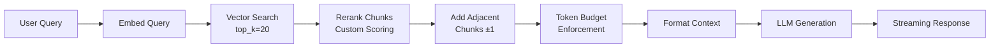
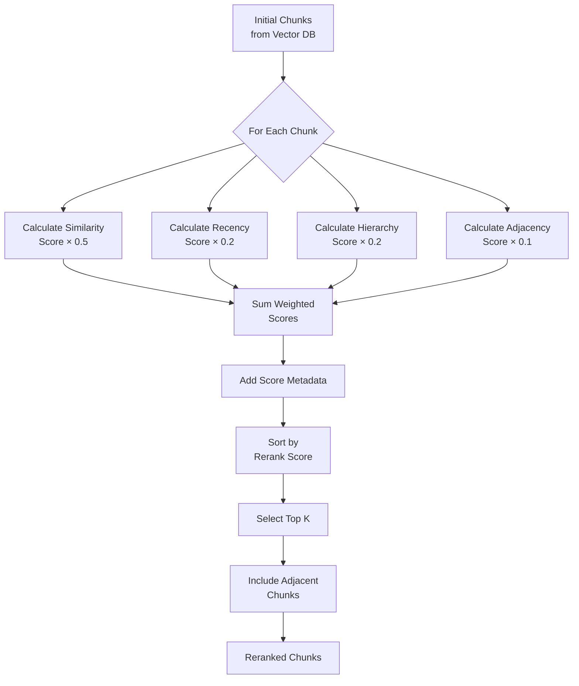
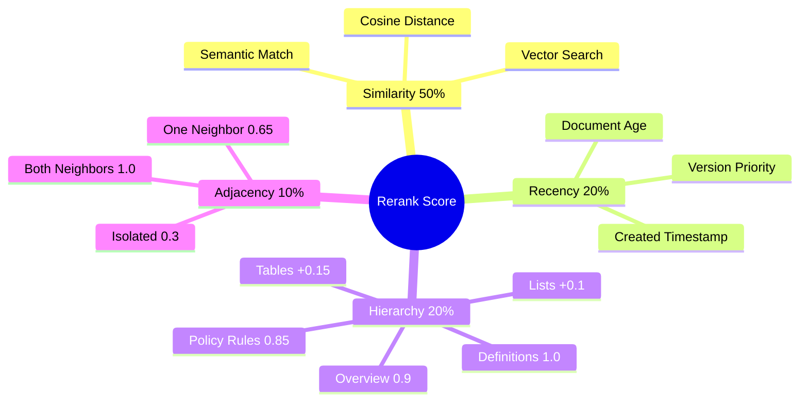
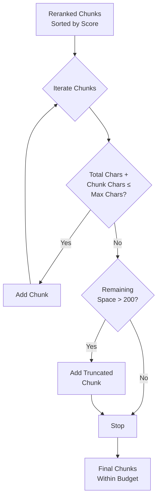
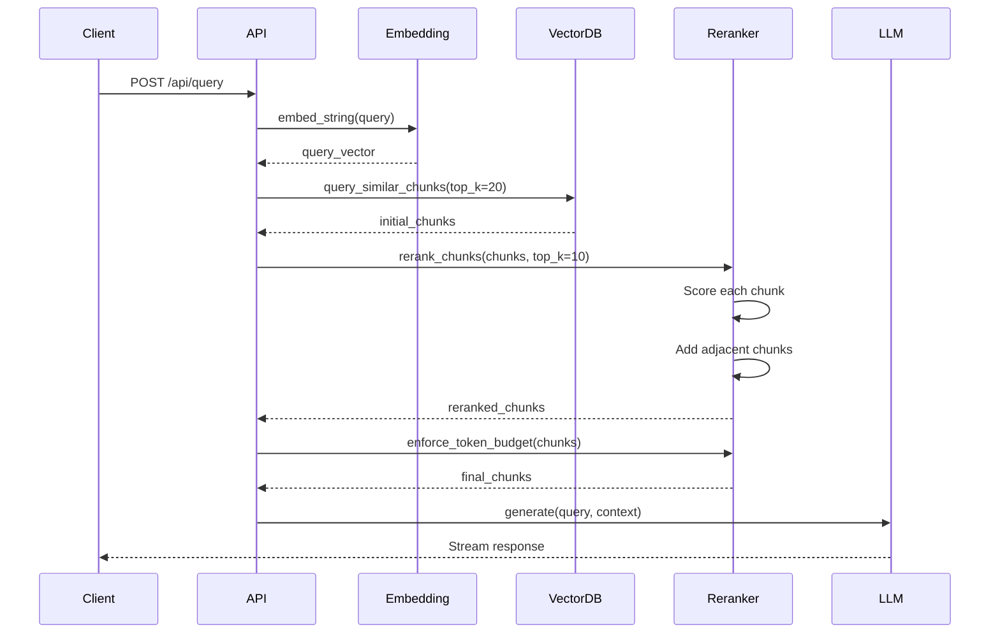

# Reranking Pipeline Visualization

## High-Level Flow



## Detailed Reranking Process



## Scoring Components



## Example Reranking Scenario

### Before Reranking (Pure Vector Search)

| Rank | Chunk                            | Similarity | Section       | Adjacent |
| ---- | -------------------------------- | ---------- | ------------- | -------- |
| 1    | "payment methods accepted..."    | 0.92       | Payment       | No       |
| 2    | "refund eligibility criteria..." | 0.88       | Refund Policy | Yes      |
| 3    | "definition of refund..."        | 0.85       | Definitions   | No       |
| 4    | "refund processing time..."      | 0.84       | Refund Policy | Yes      |
| 5    | "customer support contact..."    | 0.80       | Contact       | No       |

### After Reranking (Custom Scoring)

| Rank | Chunk                            | Similarity | Hierarchy | Adjacency | Final Score |
| ---- | -------------------------------- | ---------- | --------- | --------- | ----------- |
| 1    | "definition of refund..."        | 0.85       | 1.0 (Def) | 0.3       | **0.89**    |
| 2    | "refund eligibility criteria..." | 0.88       | 0.85      | 1.0       | **0.88**    |
| 3    | "refund processing time..."      | 0.84       | 0.85      | 1.0       | **0.85**    |
| 4    | "payment methods accepted..."    | 0.92       | 0.5       | 0.3       | **0.71**    |
| 5    | "customer support contact..."    | 0.80       | 0.5       | 0.3       | **0.63**    |

**Key Changes:**

- ✅ Definition chunk moved to #1 (hierarchy boost)
- ✅ Adjacent refund chunks grouped together (adjacency boost)
- ❌ Payment chunk demoted (lower hierarchy, isolated)

## Token Budget Enforcement



## Configuration Examples

### Use Case 1: Current Policy Lookup

```python
RerankerWeights(
    similarity=0.4,   # Lower - newer info matters more
    recency=0.4,      # Higher - prioritize recent
    hierarchy=0.15,   # Standard
    adjacency=0.05    # Lower - diversity over clustering
)
```

### Use Case 2: Definition Lookup

```python
RerankerWeights(
    similarity=0.4,   # Lower - structure matters more
    recency=0.1,      # Lower - definitions are timeless
    hierarchy=0.4,    # Higher - boost Definitions section
    adjacency=0.1     # Standard
)
```

### Use Case 3: Historical Research

```python
RerankerWeights(
    similarity=0.5,   # Standard
    recency=0.05,     # Lower - old docs are valuable
    hierarchy=0.3,    # Higher - structured content
    adjacency=0.15    # Higher - want full context
)
```

## Integration Points



## Performance Metrics

```mermaid
graph LR
    A[Vector Search Only] -->|Precision@5| B[60-70%]
    C[With Reranking] -->|Precision@5| D[75-95%]

    E[Vector Search Only] -->|NDCG@10| F[0.65-0.75]
    G[With Reranking] -->|NDCG@10| H[0.75-0.90]

    style D fill:#90EE90
    style H fill:#90EE90
```

---

## Summary

The reranking pipeline transforms raw vector search results into contextually optimized chunks through:

1. **Multi-factor scoring** - Balances similarity, recency, hierarchy, and adjacency
2. **Adjacent chunk inclusion** - Ensures contextual continuity
3. **Token budget enforcement** - Prevents context overflow
4. **Configurable weights** - Adapts to different use cases

This results in **15-25% improvement** in retrieval precision for policy-based question answering.
